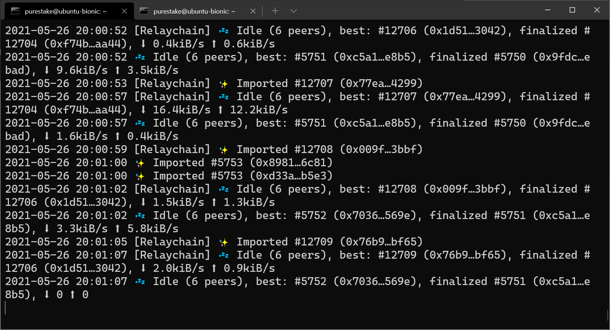
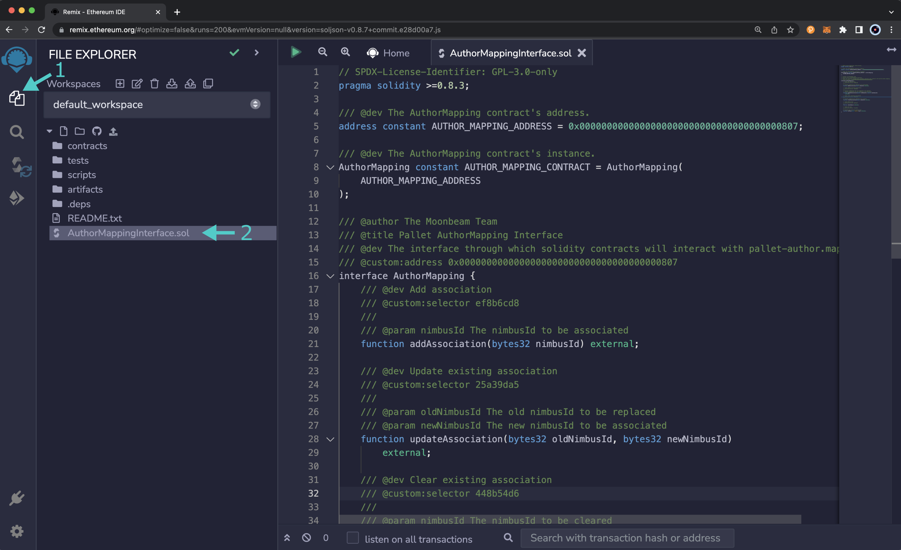
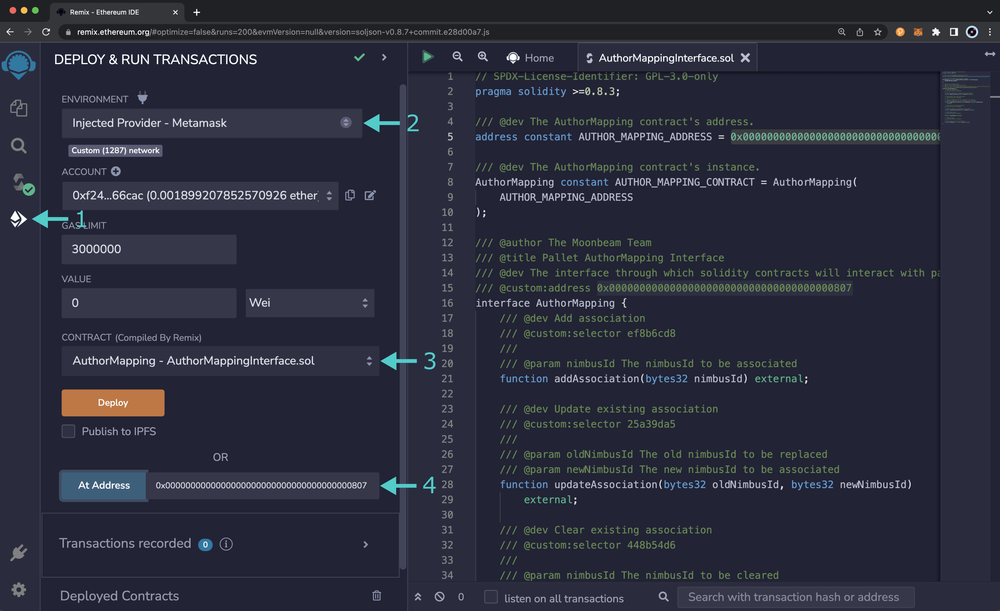
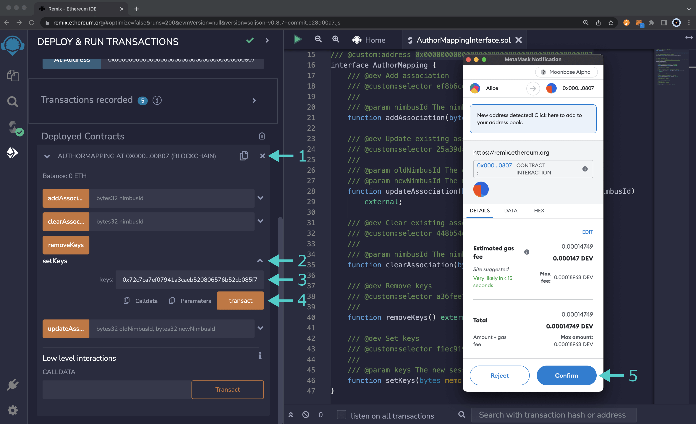

# Author Mapping Precompile


## Introduction

The author mapping precompiled contract on Moonsama Network allows collator candidates to map session keys to a Moonsama Network address, where block rewards are paid out, through a familiar and easy-to-use Solidity interface. This enables candidates to complete author mapping with a Ledger or any other Ethereum wallet compatible with Moonsama Network. However, it is recommended to generate your keys on an air-gapped machine. You can find out more information by referring to the [account requirements section of the Collator Requirements page](node-operators/networks/collators/requirements/#account-requirements).

To become a collator candidate, you must be [running a collator node](node-operators/networks/run-a-node/overview/). You'll also need to [join the candidate pool](node-operators/networks/collators/activities/#become-a-candidate) and submit a [bond](builders/pallets-precompiles/precompiles/author-mapping/#bonds) and fully sync your node before you can generate your session keys and map them to your account. There is an [additional bond](builders/pallets-precompiles/precompiles/author-mapping/#bonds) that must be paid when mapping your session keys.

The precompile is located at the following address:

Moonsama Network

```
0x0000000000000000000000000000000000000807

```

Note

There can be some unintended consequences when using the precompiled contracts on Moonsama Network. Please refer to the [Security Considerations](builders/get-started/eth-compare/security) page for more information.

## The Author Mapping Solidity Interface

`[AuthorMappingInterface.sol](/blob/master/precompiles/author-mapping/AuthorMappingInterface.sol)` is a Solidity interface that allows developers to interact with the precompile's methods.

- **removeKeys**() - removes the author ID and session keys. Replaces the deprecated `clearAssociation` extrinsic
- **setKeys**(*bytes memory* keys) — accepts the result of calling `author_rotateKeys`, which is the concatenated public keys of your Nimbus and VRF keys, and sets the author ID and the session keys at once. Useful after a key rotation or migration. Calling `setKeys` requires a [bond](builders/pallets-precompiles/precompiles/author-mapping/#mapping-bonds). Replaces the deprecated `addAssociation` and `updateAssociation` extrinsics
- **nimbusIdOf**(*address* who) - retrieves the Nimbus ID of the given address. If no Nimbus ID exists for the given address, it returns `0`
- **addressOf**(*bytes32* nimbusId) - retrieves the address associated to a given Nimbus ID. If the Nimbus ID is unknown, it returns `0`
- **keysOf**(*bytes32* nimbusId) - retrieves the keys associated to the given Nimbus ID. If the Nimbus ID is unknown, it returns empty bytes

The following methods are **deprecated**, but will still exist for backwards compatibility:

- **addAssociation**(*bytes32* nimbusId) — maps your author ID to the H160 account from which the transaction is being sent, ensuring it is the true owner of its private keys. It requires a [bond](builders/pallets-precompiles/precompiles/author-mapping/#mapping-bonds). This method maintains backwards compatibility by setting the `keys` to the author ID by default
- **updateAssociation**(*bytes32* oldNimbusId, *bytes32* newNimbusId) — updates the mapping from an old author ID to a new one. Useful after a key rotation or migration. It executes both the `add` and `clear` association extrinsics automically, enabling key rotation without needing a second bond. This method maintains backwards compatibility by setting the `newKeys` to the author ID by default
- **clearAssociation**(*bytes32* nimbusId) — clears the association of an author ID to the H160 account from which the transaction is being sent, which needs to be the owner of that author ID. Also refunds the bond

## Required Bonds

To follow along with this tutorial, you'll need to join the candidate pool and map your session keys to your H160 Ethereum-style account. Two bonds are required to perform both of these actions.

The minimum bond to join the candidate pool is set as follows:

Moonsama Network

```
2000000 GLMR

```

There is a bond that is sent when mapping your session keys with your account. This bond is per session keys registered. The bond set is as follows:

Moonsama Network

```
10000 GLMR

```

## Interact with the Solidity Interface

### Checking Prerequisites

The below example is demonstrated on , however, similar steps can be taken for Moonsama Network and Moonsama Network. You should:

- Have MetaMask installed and [connected to ](tokens/connect/metamask/)
- Have an account with DEV tokens. You should have enough to cover the [candidate and mapping bonds](builders/pallets-precompiles/precompiles/author-mapping/#bonds) plus gas fees to send the transaction and map your session keys to your account. To get enough DEV tokens to follow along with this guide, you can contact a moderator directly via the [Moonsama Network Discord server](https://discord.gg/PfpUATX)
- Make sure you're [running a collator node](node-operators/networks/run-a-node/overview/) and it's fully synced
- Make sure you've [joined the candidate pool](node-operators/networks/collators/activities/#become-a-candidate)

As previously mentioned, you can use a Ledger by connecting it to MetaMask, please refer to the [Ledger](tokens/connect/ledger/) guides on how to import your Ledger to MetaMask. Please note that it is not recommended to use Ledger for production purposes. You can find out more information by referring to the [account requirements section of the Collator Requirements page](node-operators/networks/collators/requirements/#account-requirements).

### Generate Session Keys

To match the Substrate standard, Moonsama Network collator's session keys are [SR25519](https://wiki.polkadot.network/docs/learn-keys#what-is-sr25519-and-where-did-it-come-from). This guide will show you how you can create/rotate your session keys associated with your collator node.

First, make sure you're [running a collator node](node-operators/networks/run-a-node/overview/). Once you have your collator node running, your terminal should print similar logs:



Next, session keys can be created/rotated by sending an RPC call to the HTTP endpoint with the `author_rotateKeys` method. When you call `author_rotateKeys`, the result is the size of two keys. The response will contain a concatenated Nimbus ID and VRF key. The Nimbus ID will be used to sign blocks and the [VRF](https://wiki.polkadot.network/docs/learn-randomness#vrf) key is required for block production. The concatenated keys will be used to create an association to your H160 account for block rewards to be paid out.

For reference, if your collator's HTTP endpoint is at port `9944`, the JSON-RPC call might look like this:

The collator node should respond with the concatenated public keys of your new session keys. The first 64 hexadecimal characters after the `0x` prefix represent your Nimbus ID and the last 64 hexadecimal characters are the public key of your VRF session key. You'll use the concatenated public keys when mapping your Nimbus ID and setting the session keys in the next section.


Make sure you write down the concatenated public keys. Each of your servers, your primary and backup, should have their own unique keys. Since the keys never leave your servers, you can consider them a unique ID for that server.

Next, you'll need to register your session keys and map them to an H160 Ethereum-styled address to which the block rewards are paid.

### Remix Set Up

To get started, get a copy of `[AuthorMappingInterface.sol](/blob/master/precompiles/author-mapping/AuthorMappingInterface.sol)` and take the following steps:

1. Click on the **File explorer** tab
2. Copy and paste the file contents into a [Remix file](https://remix.ethereum.org/) named `AuthorMappingInterface.sol`



### Compile the Contract

1. Click on the **Compile** tab, second from top
2. Then to compile the interface, click on **Compile AuthorMappingInterface.sol**


### Access the Contract

1. Click on the **Deploy and Run** tab, directly below the **Compile** tab in Remix. Note: you are not deploying a contract here, instead you are accessing a precompiled contract that is already deployed
2. Make sure **Injected Provider - Metamask** is selected in the **ENVIRONMENT** drop down
3. Ensure **AuthorMappingInterface.sol** is selected in the **CONTRACT** dropdown. Since this is a precompiled contract there is no need to deploy, instead you are going to provide the address of the precompile in the **At Address** field
4. Provide the address of the author mapping precompile for : `0x0000000000000000000000000000000000000807` and click **At Address**



The author mapping precompile will appear in the list of **Deployed Contracts**.

### Map Session Keys

The next step is to map your session keys to your H160 account (an Ethereum-style address). Make sure you hold the private keys to this account, as this is where the block rewards are paid out to.

To map your session keys to your account, you need to be inside the [candidate pool](node-operators/networks/collators/activities/#become-a-candidate). Once you are a candidate, you need to send a mapping extrinsic. Note that this will bond tokens per author ID registered.

Before getting started, ensure you're connected to the account that you want to map your session keys to. This will be the account where you will receive block rewards.

1. Expand the **AUTHORMAPPING** contract
2. Expand the **setKeys** method
3. Enter your session keys
4. Click **transact**
5. Confirm the MetaMask transaction that appears by clicking **Confirm**



To verify you have mapped your session keys successfully, you can use either the `mappingWithDeposit` method or the `nimbusLookup` method of the [author mapping pallet](node-operators/networks/collators/account-management/#author-mapping-interface). To do so, please refer to the [Check Mappings section of the Collator Account Management guide](node-operators/networks/collators/account-management/#check-the-mappings).