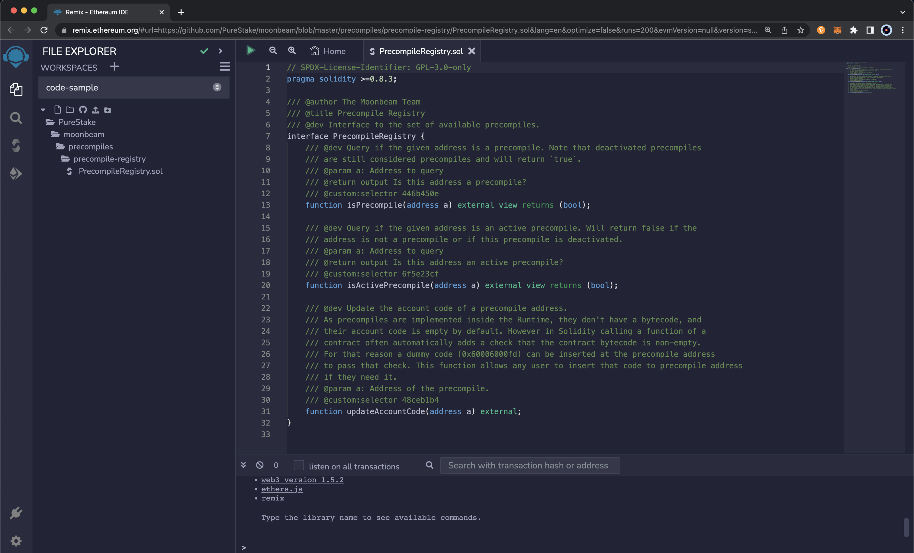
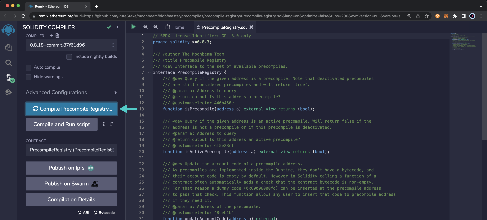

# Precompile Registry


## Introduction

The Precompile Registry serves as a single source of truth for the available [precompiles on Moonbeam](https://docs.moonbeam.network/builders/pallets-precompiles/precompiles/overview). The Precompile Registry can be used to determine if an address corresponds to a precompile and whether or not a precompile is active or deprecated. This is particularly useful when there are upstream changes within the Substrate and Polkadot ecosystems that result in backward-incompatible changes to precompiles. Developers can design an exit strategy to ensure their dApp recovers gracefully in these scenarios.

The Precompile Registry also serves an additional purpose, as it allows any user to set "dummy code" (`0x60006000fd`) for precompiles, which makes precompiles callable from Solidity. This is necessary as precompiles on Moonbeam, by default, don't have bytecode. The "dummy code" can bypass checks in Solidity that ensure contract bytecode exists and is non-empty.

The Registry Precompile is located at the following address:

MoonbeamMoonriverMoonbase Alpha

```
0x0000000000000000000000000000000000000815

```

Note

There can be some unintended consequences when using the precompiled contracts on Moonbeam. Please refer to the [Security Considerations](https://docs.moonbeam.network/builders/get-started/eth-compare/security) page for more information.

## The Precompile Registry Solidity Interface

`[PrecompileRegistry.sol](https://github.com/PureStake/moonbeam/blob/master/precompiles/precompile-registry/PrecompileRegistry.sol)` is a Solidity interface that allows developers to interact with the precompile's methods.

- **isPrecompile**(*address* a) - returns a *bool* indicating whether a given address is a precompile or not. Returns `true` for active and deprecated precompiles
- **isActivePrecompile**(*address* a) - returns a *bool* indicating whether a given address is an active precompile or not. Returns `false` if a precompile has been deprecated
- **updateAccountCode**(*address* a) - updates a given precompile's bytecode with dummy code (`0x60006000fd`) given the address of the precompile. Precompiles, by default, don't have bytecode associated with them. This function can be used to add dummy bytecode to bypass requirements in Solidity that check if a contract's bytecode is not empty before its functions can be called

## Interact with the Precompile Registry Solidity Interface

The following sections will cover how to interact with the Registry Precompile from [Remix](https://docs.moonbeam.network/builders/build/eth-api/dev-env/remix) and [Ethereum libraries](https://docs.moonbeam.network/builders/build/eth-api/libraries/), such as [Ethers.js](https://docs.moonbeam.network/builders/build/eth-api/libraries/ethersjs), [Web3.js](https://docs.moonbeam.network/builders/build/eth-api/libraries/web3js), and [Web3.py](https://docs.moonbeam.network/builders/build/eth-api/libraries/web3py).

The examples in this guide will be on Moonbase Alpha. To test out the examples in this guide on Moonbeam or Moonriver, you will need to have your own endpoint and API key, which you can get from one of the supported [Endpoint Providers](https://docs.moonbeam.network/builders/get-started/endpoints/).

### Use Remix to Interact with the Precompile Registry

To quickly get started with [Remix](https://docs.moonbeam.network/builders/build/eth-api/dev-env/remix), the [Precompile Registry contract has been loaded from GitHub](https://remix.ethereum.org/#url=https://github.com/PureStake/moonbeam/blob/master/precompiles/precompile-registry/PrecompileRegistry.sol). You can also create a new file in Remix and manually paste in the contents of the `[PrecompileRegistry.sol](https://docs.moonbeam.network/builders/pallets-precompiles/precompiles/registry/#the-solidity-interface)` contract.



Then you can take the following steps to compile, deploy, and interact with the Precompile Registry:

1.  
    
    From the **Compile** tab, click on **Compile PrecompileRegistry.sol** to compile the contract. A green checkmark will appear upon successfully compiling the contract
    
    
    
2.   
    
    From the **Deploy and run transactions** tab, you can load the Precompile Registry using its address:
    
    1. Make sure **Injected Provider - Metamask** is selected in the **ENVIRONMENT** drop down and you've connected MetaMask to Moonbase Alpha
    2. Ensure **PrecompileRegistry** is selected in the **CONTRACT** dropdown. Since this is a precompiled contract there is no need to deploy, instead you are going to provide the address of the Precompile in the **At Address** field
    3. Provide the address of the Precompile Registry for Moonbase Alpha: `0x0000000000000000000000000000000000000815` and click **At Address**
    4. The Precompile Registry will appear in the list of **Deployed Contracts**
    
    
    
3.  
    
    You can interact with any of the precompile's methods. Under **Deployed Contracts**, expand the Precompile Registry to view the list of methods. For example, you can use the **isPrecompile** function to check if an address is a precompile
    
    
    

### Use Ethereuem Libraries to Interact with the Precompile Registry

To interact with the Precompile Registry's Solidity interface with an Ethereum library, you'll need the Precompile Registry's ABI.

Once you have the ABI, you can interact with the Registry using the Ethereum library of your choice. Generally speaking, you'll take the following steps:

1. Create a provider
2. Create a contract instance of the Precompile Registry
3. Interact with the Precompile Registry's functions

Remember

The following snippets are for demo purposes only. Never store your private keys in a JavaScript or Python file.

```
import { ethers } from 'ethers'; // Import Ethers library
import ABI from './precompileRegistryABI.js'; // Import Precompile Registry ABI

const privateKey = 'INSERT_PRIVATE_KEY';

// Create Ethers provider and signer
const provider = new ethers.JsonRpcProvider(
  'https://rpc.api.moonbase.moonbeam.network'
);
const signer = new ethers.Wallet(privateKey, provider);

// Create interface for the Precompile Registry
const precompileRegistry = new ethers.Contract(
  '0x0000000000000000000000000000000000000815',
  ABI,
  signer
);

// Interact with the Precompile Registry
const isActivePrecompile = async () => {
  const proxyPrecompile = '0x000000000000000000000000000000000000080b';

  // Check if the Proxy Precompile is a precompile
  const isPrecompile = await precompileRegistry.isPrecompile(proxyPrecompile);
  // Should return 'Address is a precompile: true'
  console.log(`Address is a precompile: ${isPrecompile}`);

  // Check if the Proxy Precompile is an active precompile
  const isActivePrecompile = await precompileRegistry.isActivePrecompile(
    proxyPrecompile
  );
  // Should return 'Address is an active precompile: true'
  console.log(`Address is an active precompile: ${isActivePrecompile}`);
};

isActivePrecompile();

```