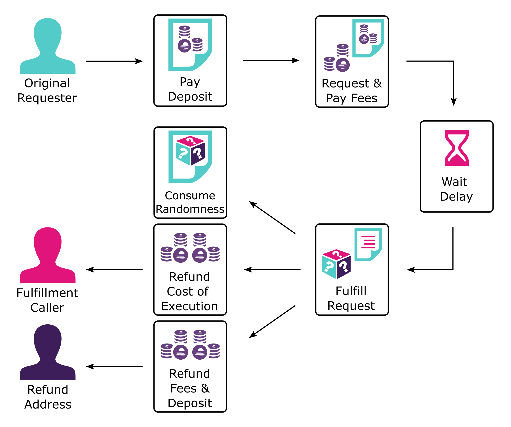
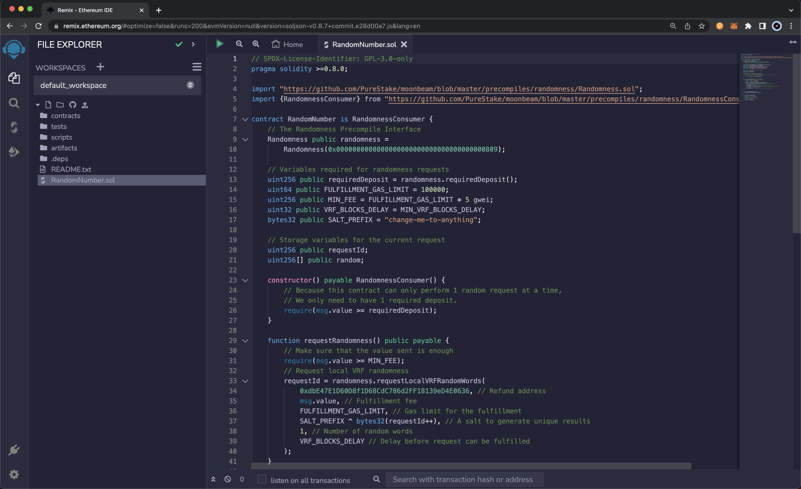
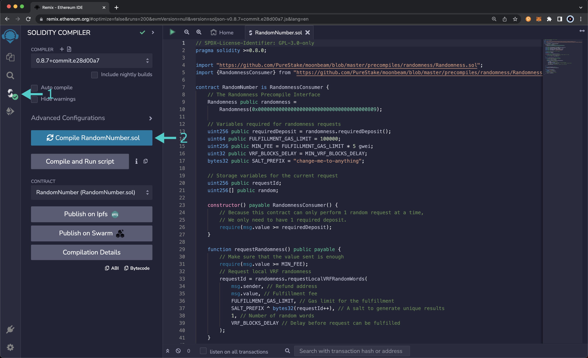
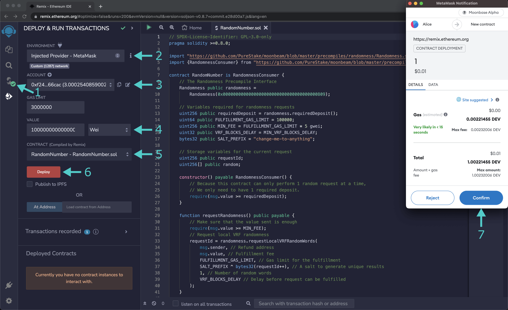
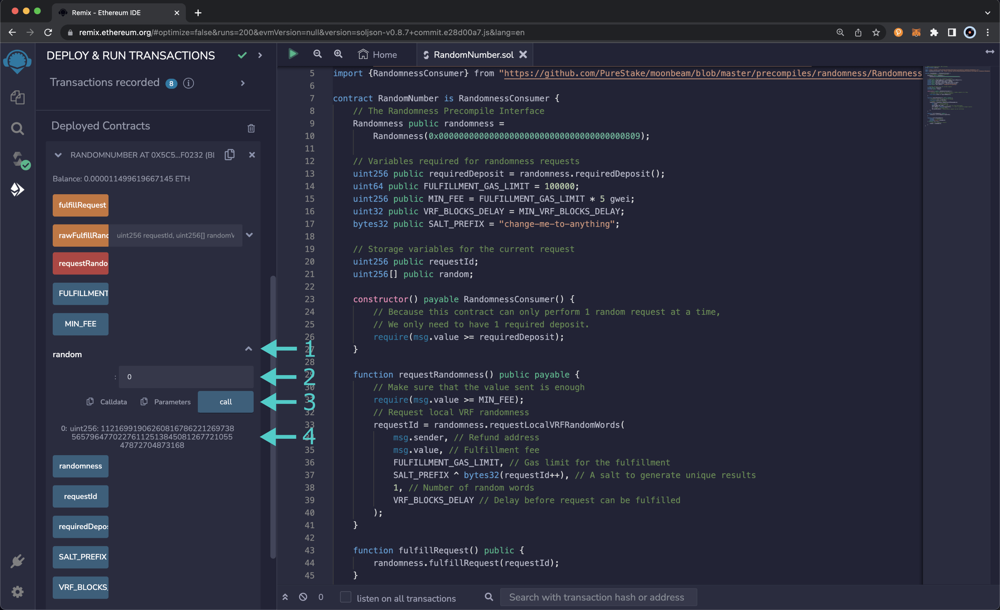
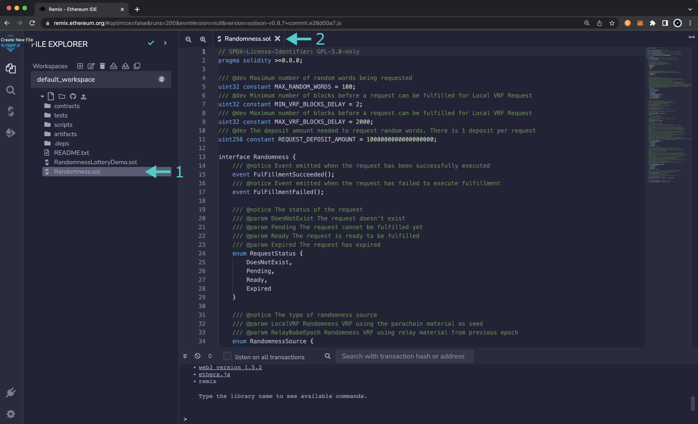
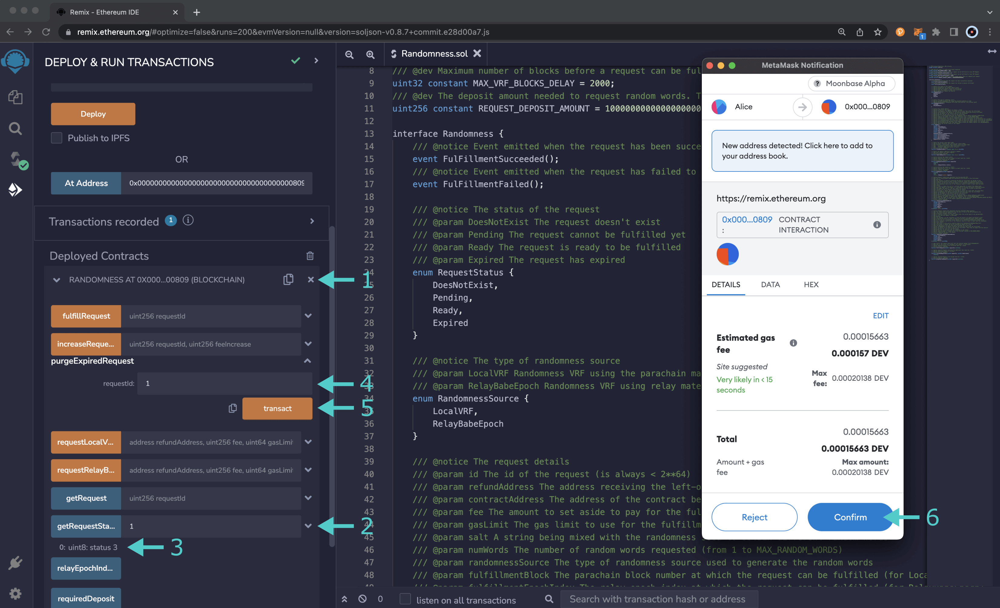

# Randomness Precompile


## Introduction

Moonbeam utilizes verifiable random functions (VRF) to generate randomness that can be verified on-chain. A VRF is a cryptographic function that takes some input and produces random values, along with a proof of authenticity that these random values were generated by the submitter. The proof can be verified by anyone to ensure the random values generated were calculated correctly.

There are two available sources of randomness that provide random inputs based on block producers' VRF keys and past randomness results: [local VRF](https://docs.moonbeam.network/builders/pallets-precompiles/precompiles/randomness/#local-vrf) and [BABE epoch randomness](https://docs.moonbeam.network/builders/pallets-precompiles/precompiles/randomness/#babe-epoch-randomness). Local VRF is determined directly within Moonbeam using the collator of the block's VRF key and the last block's VRF output. On the other hand, [BABE](https://wiki.polkadot.network/docs/learn-consensus#block-production-babe) epoch randomness is based on all the VRF produced by the relay chain validators during a complete [epoch](https://wiki.polkadot.network/docs/glossary#epoch).

For more information on the two sources of randomness, how the request and fulfillment process works, and security considerations, please refer to the [Randomness on Moonbeam](https://docs.moonbeam.network/learn/features/randomness) page.

Moonbeam provides a randomness precompile, which is a Solidity interface that enables smart contract developers to generate randomness via local VRF or BABE epoch randomness using the Ethereum API. Moonbeam also provides a randomness consumer Solidity contract that your contract must inherit from in order to consume fulfilled randomness requests.

This guide will show you how to use the randomness precompile and randomness consumer contract to create a lottery where the winners will randomly be selected. You'll also learn how to interact with the randomness precompile directly to perform actions such as purging an expired randomness request.

The randomness precompile is located at the following address:

MoonbeamMoonriverMoonbase Alpha

```
0x0000000000000000000000000000000000000809

```

Note

There can be some unintended consequences when using the precompiled contracts on Moonbeam. Please refer to the [Security Considerations](https://docs.moonbeam.network/builders/get-started/eth-compare/security) page for more information.

## The Randomness Solidity Interface

[Randomness.sol](https://github.com/PureStake/moonbeam/blob/master/precompiles/randomness/Randomness.sol) is a Solidity interface that allows developers to interact with the precompile's methods.

The interface includes functions, constants, events, and enums, as covered in the following sections.

### Functions

The interface includes the following functions:

- **relayEpochIndex**() — returns the current relay epoch index, where an epoch represents real time and not a block number
- **requiredDeposit**() — returns the deposit required to perform a randomness request
- **getRequestStatus**(*uint256* requestId) — returns the request status of a given randomness request
- **getRequest**(*uint256* requestId) — returns the request details of a given randomness request
- **requestLocalVRFRandomWords**(*address* refundAddress, *uint256* fee, *uint64* gasLimit, *bytes32* salt, *uint8* numWords, *uint64* delay) — request random words generated from the parachain VRF
- **requestRelayBabeEpochRandomWords**(*address* refundAddress, *uint256* fee, *uint64* gasLimit, *bytes32* salt, *uint8* numWords) — request random words generated from the relay chain BABE consensus
- **fulfillRequest**(*uint256* requestId) — fulfill the request which will call the consumer contract method `[fulfillRandomWords](about:blank#:~:text=rawFulfillRandomWords(uint256%20requestId,%20uint256[]%20memory%20randomWords))`. Fees of the caller are refunded if the request is fulfillable
- **increaseRequestFee**(*uint256* requestId, *uint256* feeIncrease) — increases the fee associated with a given randomness request. This is needed if the gas price increases significantly before the request is fulfilled
- **purgeExpiredRequest**(*uint256* requestId) — removes a given expired request from storage and transfers the request fees to the caller and the deposit back to the original requester

Where the inputs that need to be provided can be defined as:

- **requestId** - the ID of the randomness request
- **refundAddress** - the address receiving the left-over fees after the fulfillment
- **fee** - the amount to set aside to pay for the fulfillment
- **gasLimit** - the gas limit to use for the fulfillment
- **salt** - a string that is mixed with the randomness seed to obtain different random words
- **numWords** - the number of random words requested, up to the maximum number of random words
- **delay** - the number of blocks that must pass before the request can be fulfilled. This value will need to be between the minimum and maximum number of blocks before a local VRF request can be fulfilled
- **feeIncrease** - the amount to increase fees by

### Constants

The interface includes the following constants:

- **maxRandomWords** - the maximum number of random words being requested
- **minBlockDelay** - the minimum number of blocks before a request can be fulfilled for local VRF requests
- **maxBlockDelay** - the maximum number of blocks before a request can be fulfilled for local VRF requests
- **deposit** - the deposit amount needed to request random words. There is one deposit per request

MoonbeamMoonriverMoonbase Alpha

| Variable | Value |
| --- | --- |
| MAX_RANDOM_WORDS | 100 words |
| MIN_VRF_BLOCKS_DELAY | 2 blocks |
| MAX_VRF_BLOCKS_DELAY | 2000 blocks |
| REQUEST_DEPOSIT_AMOUNT | 100 GLMR |

### Events

The interface includes the following events:

- **FulfillmentSucceeded**() - emitted when the request has been successfully executed
- **FulfillmentFailed**() - emitted when the request has failed to execute fulfillment

### Enums

The interface includes the following enums:

- **RequestStatus** - the status of the request, which can be `DoesNotExist` (0), `Pending` (1), `Ready` (2), or `Expired` (3)
- **RandomnessSource** - the type of the randomness source, which can be `LocalVRF` (0) or `RelayBabeEpoch` (1)

## The Randomness Consumer Solidity Interface

The `[RandomnessConsumer.sol](https://github.com/PureStake/moonbeam/blob/4e2a5785424be6faa01cd14e90155d9d2ec734ee/precompiles/randomness/RandomnessConsumer.sol)` Solidity interface makes it easy for smart contracts to interact with the randomness precompile. Using the randomness consumer ensures the fulfillment comes from the randomness precompile.

The consumer interface includes the following functions:

- **fulfillRandomWords**(*uint256* requestId, *uint256[] memory* randomWords) - handles the VRF response for a given request. This method is triggered by a call to `rawFulfillRandomWords`
- **rawFulfillRandomWords**(*uint256* requestId, *uint256[] memory* randomWords) - executed when the `[fulfillRequest` function](about:blank#:~:text=fulfillRequest(uint256%20requestId)) of the randomness precompile is called. The origin of the call is validated, ensuring the randomness precompile is the origin, and then the `fulfillRandomWords` method is called

## Request & Fulfill Process

To consume randomness, you must have a contract that does the following:

- Imports the `Randomness.sol` precompile and `RandomnessConsumer.sol` interface
- Inherits from the `RandomnessConsumer.sol` interface
- Requests randomness through the precompile's `[requestLocalVRFRandomWords` method](https://docs.moonbeam.network/builders/pallets-precompiles/precompiles/randomness/#:~:text=requestLocalVRFRandomWords) or `[requestRelayBabeEpochRandomWords` method](https://docs.moonbeam.network/builders/pallets-precompiles/precompiles/randomness/#:~:text=requestRelayBabeEpochRandomWords), depending on the source of randomness you want to use
- Requests fulfillment through the precompile's `[fulfillRequest` method](https://docs.moonbeam.network/builders/pallets-precompiles/precompiles/randomness/#:~:text=fulfillRequest)
- Consumes randomness through a `fulfillRandomWords` method with the same [signature as the `fulfillRandomWords` method](about:blank#:~:text=fulfillRandomWords(uint256%20requestId,%20uint256[]%20memory%20randomWords)) of the `RandomnessConsumer.sol` contract

When randomness is requested through the precompile's `requestLocalVRFRandomWords` or `requestRelayBabeEpochRandomWords` method, a fee is set aside to pay for the fulfillment of the request. When using local VRF, to increase unpredictability, a specified delay period (in blocks) must pass before the request can be fulfilled. At the very least, the delay period must be greater than one block. For BABE epoch randomness, you do not need to specify a delay but can fulfill the request at the beginning of the 2nd epoch following the current one.

After the delay, fulfillment of the request can be manually executed by anyone through the `fulfillRequest` method using the fee that was initially set aside for the request.

When fulfilling the randomness request via the precompile's `fulfillRequest` method, the `[rawFulfillRandomWords](about:blank#:~:text=rawFulfillRandomWords(uint256%20requestId,%20uint256[]%20memory%20randomWords))` function in the `RandomnessConsumer.sol` contract will be called, which will verify that the sender is the randomness precompile. From there, `[fulfillRandomWords](about:blank#:~:text=fulfillRandomWords(uint256%20requestId,%20uint256[]%20memory%20randomWords))` is called and the requested number of random words are computed using the current block's randomness result and a given salt and returned. If the fulfillment was successful, the `[FulfillmentSucceeded` event](https://docs.moonbeam.network/builders/pallets-precompiles/precompiles/randomness/#:~:text=FulfillmentSucceeded) will be emitted; otherwise the `[FulfillmentFailed` event](https://docs.moonbeam.network/builders/pallets-precompiles/precompiles/randomness/#:~:text=FulfillmentFailed) will be emitted.

For fulfilled requests, the cost of execution will be refunded from the request fee to the caller of `fulfillRequest`. Then any excess fees and the request deposit are transferred to the specified refund address.

Your contract's `fulfillRandomWords` callback is responsible for handling the fulfillment. For example, in a lottery contract, the callback would use the random words to choose a winner and payout the winnings.

If a request expires it can be purged through the precompile's `[purgeExpiredRequest` function](https://docs.moonbeam.network/builders/pallets-precompiles/precompiles/randomness/#:~:text=purgeExpiredRequest). When this function is called the request fee is paid out to the caller and the deposit will be returned to the original requester.

The happy path for a randomness request is shown in the following diagram:



## Generate a Random Number using the Randomness Precompile

In the following sections of this tutorial, you'll learn how to create a smart contract that generates a random number using the Randomness Precompile and the Randomness Consumer. If you want to just explore some of the functions of the Randomness Precompile, you can skip ahead to the [Use Remix to Interact Directly with the Randomness Precompile](https://docs.moonbeam.network/builders/pallets-precompiles/precompiles/randomness/#interact-directly) section.

### Checking Prerequisites

For this guide, you will need to have the following:

- [MetaMask installed and connected to Moonbase Alpha](https://docs.moonbeam.network/tokens/connect/metamask/)
- An account funded with DEV tokens. You can get DEV tokens for testing on Moonbase Alpha once every 24 hours from the [Moonbase Alpha Faucet](https://faucet.moonbeam.network/)

### Create a Random Number Generator Contract

The contract that will be created in this section includes the functions that you'll need at a bare minimum to request randomness and consume the results from fulfilling randomness requests.

**This contract is for educational purposes only and is not meant for production use.**

The contract will include the following functions:

- A constructor that accepts the deposit required to request randomness
- A function that submits randomness requests. For this example, the source of randomness will be local VRF, but you can easily modify the contract to use BABE epoch randomness
- A function that fulfills the request by calling the `fulfillRequest` function of the Randomness Precompile. This function will be `payable` as the fulfillment fee will need to be submitted at the time of the randomness request
- A function that consumes the fulfillment results. This function's signature must match the [signature of the `fulfillRandomWords` method](about:blank#:~:text=fulfillRandomWords(uint256%20requestId,%20uint256[]%20memory%20randomWords)) of the Randomness Consumer contract

Without further ado, the contract is as follows:

```
// SPDX-License-Identifier: GPL-3.0-only
pragma solidity >=0.8.0;

import "https://github.com/PureStake/moonbeam/blob/master/precompiles/randomness/Randomness.sol";
import {RandomnessConsumer} from "https://github.com/PureStake/moonbeam/blob/master/precompiles/randomness/RandomnessConsumer.sol";

contract RandomNumber is RandomnessConsumer {
    // The Randomness Precompile Interface
    Randomness public randomness =
        Randomness(0x0000000000000000000000000000000000000809);

    // Variables required for randomness requests
    uint256 public requiredDeposit = randomness.requiredDeposit();
    uint64 public FULFILLMENT_GAS_LIMIT = 100000;
    // The fee can be set to any value as long as it is enough to cover
    // the fulfillment costs. Any leftover fees will be refunded to the
    // refund address specified in the requestRandomness function below
    uint256 public MIN_FEE = FULFILLMENT_GAS_LIMIT * 5 gwei;
    uint32 public VRF_BLOCKS_DELAY = MIN_VRF_BLOCKS_DELAY;
    bytes32 public SALT_PREFIX = "change-me-to-anything";

    // Storage variables for the current request
    uint256 public requestId;
    uint256[] public random;

    constructor() payable RandomnessConsumer() {
        // Because this contract can only perform 1 random request at a time,
        // We only need to have 1 required deposit.
        require(msg.value >= requiredDeposit);
    }

    function requestRandomness() public payable {
        // Make sure that the value sent is enough
        require(msg.value >= MIN_FEE);
        // Request local VRF randomness
        requestId = randomness.requestLocalVRFRandomWords(
            msg.sender, // Refund address
            msg.value, // Fulfillment fee
            FULFILLMENT_GAS_LIMIT, // Gas limit for the fulfillment
            SALT_PREFIX ^ bytes32(requestId++), // A salt to generate unique results
            1, // Number of random words
            VRF_BLOCKS_DELAY // Delay before request can be fulfilled
        );
    }

    function fulfillRequest() public {
        randomness.fulfillRequest(requestId);
    }

    function fulfillRandomWords(
        uint256, /* requestId */
        uint256[] memory randomWords
    ) internal override {
        // Save the randomness results
        random = randomWords;
    }
}

```

As you can see, there are also some constants in the contract that can be edited as you see fit, especially the `SALT_PREFIX` which can be used to produce unique results.

In the following sections, you'll use Remix to deploy and interact with the contract.

### Remix Set Up

To add the contract to Remix and follow along with this section of the tutorial, you will need to create a new file named `RandomnessNumber.sol` in Remix and paste the `RandomNumber` contract into the file.



### Compile & Deploy the Random Number Generator Contract

To compile the `RandomNumber.sol` contract in Remix, you'll need to take the following steps:

1. Click on the **Compile** tab, second from top
2. Click on the **Compile RandomNumber.sol** button

If the contract was compiled successfully, you will see a green checkmark next to the **Compile** tab.



Now you can go ahead and deploy the contract by taking these steps:

1. Click on the **Deploy and Run** tab directly below the **Compile** tab
2. Make sure **Injected Provider - Metamask** is selected in the **ENVIRONMENT** dropdown. Once you select **Injected Provider - Metamask**, you might be prompted by MetaMask to connect your account to Remix
3. Make sure the correct account is displayed under **ACCOUNT**
4. Enter the deposit amount in the **VALUE** field, which is `1000000000000000000` in Wei (`1` Ether)
5. Ensure **RandomNumber - RandomNumber.sol** is selected in the **CONTRACT** dropdown
6. Click **Deploy**
7. Confirm the MetaMask transaction that appears by clicking **Confirm**



The RANDOMNUMBER contract will appear in the list of Deployed Contracts.

### Submit a Request to Generate a Random Number

To request randomness, you're going to use the `requestRandomness` function of the contract, which will require you to submit a deposit as defined in the Randomness Precompile. You can submit the randomness request and pay the deposit by taking these steps:

1. Enter an amount in the **VALUE** field for the fulfillment fee, it must be equal to or greater than the minimum fee specified in the `RandomNumber` contract, which is `500000` Gwei
2. Expand the **RANDOMNUMBER** contract
3. Click on the **requestRandomness** button
4. Confrm the transaction in MetaMask


Once you submit the transaction, the `requestId` will be updated with the ID of the request. You can use the `requestId` call of the Random Number contract to get the request ID and the `getRequestStatus` functon of the Randomness Precompile to check the status of this request ID.

### Fulfill the Request and Save the Random Number

After submitting the randomness request, you'll need to wait for the duration of the delay before you can fulfill the request. For the `RandomNumber.sol` contract, the delay was set to the minimum block delay defined in the Randomness Precompile, which is 2 blocks. You must also fulfill the request before it is too late. For local VRF, the request expires after 10000 blocks and for BABE epoch randomness, the request expires after 10000 epochs.

Assuming you've waited for the minimum blocks (or epochs if you're using BABE epoch randomness) to pass and the request hasn't expired, you can fulfill the request by taking the following steps:

1. Click on the **fulfillRequest** button
2. Confirming the transaction in MetaMask


Once the request has been fulfilled, you can check the random number that was generated:

1. Expand the **random** function
2. Since the contract only requested one random word, you can get the random number by accessing the `0` index of the `random` array
3. Click **call**
4. The random number will appear below the **call** button



Upon successful fulfillment, the excess fees and deposit will be sent to the address specified as the refund address.

If the request happened to expire before it could be fulfilled, you can interact with the Randomness Precompile directly to purge the request and unlock the deposit and fees. Please refer to the following section for instructions on how to do this.

## Use Remix to Interact Directly with the Randomness Precompile

In addition to interacting with the randomness precompile via a smart contract, you can also interact with it directly in Remix to perform operations such as creating a randomness request, checking on the status of a request, and purging expired requests. Remember, you need to have a contract that inherits from the consumer contract in order to fulfill requests, as such if you fulfill a request using the precompile directly there will be no way to consume the results.

### Remix Set Up

To add the interfaces to Remix and follow along with this section of the tutorial, you will need to:

1. Get a copy of `[Randomness.sol](https://github.com/PureStake/moonbeam/blob/master/precompiles/randomness/Randomness.sol)`
2. Paste the file contents into a Remix file named **Randomness.sol**



### Compile & Access the Randomness Precompile

Next, you will need to compile the `Randomness.sol` file in Remix. To get started, make sure you have the **Randomness.sol** file open and take the following steps:

1. Click on the **Compile** tab, second from top
2. To compile the contract, click on **Compile Randomness.sol**

If the contract was compiled successfully, you will see a green checkmark next to the **Compile** tab.

Instead of deploying the randomness precompile, you will access the interface given the address of the precompiled contract:

1. Click on the **Deploy and Run** tab directly below the **Compile** tab in Remix. Please note the precompiled contract is already deployed
2. Make sure **Injected Provider - Metamask** is selected in the **ENVIRONMENT** dropdown. Once selected, you might be prompted by MetaMask to connect your account to Remix
3. Make sure the correct account is displayed under **ACCOUNT**
4. Ensure **Randomness - Randomness.sol** is selected in the **CONTRACT** dropdown. Since this is a precompiled contract, there is no need to deploy any code. Instead we are going to provide the address of the precompile in the **At Address** Field
5. Provide the address of the batch precompile: `0x0000000000000000000000000000000000000809` and click **At Address**


The **RANDOMNESS** precompile will appear in the list of **Deployed Contracts**. You will use this to fulfill the randomness request made from the lottery contract later on in this tutorial.

### Get Request Status & Purge Expired Request

Anyone can purge expired requests. You do not need to be the one who requested the randomness to be able to purge it. When you purge an expired request, the request fees will be transferred to you, and the deposit for the request will be returned to the original requester.

To purge a request, first you have to make sure that the request has expired. To do so, you can verify the status of a request using the `getRequestStatus` function of the precompile. The number that is returned from this call corresponds to the index of the value in the `[RequestStatus](https://docs.moonbeam.network/builders/pallets-precompiles/precompiles/randomness/#enums)` enum. As a result, you'll want to verify the number returned is `3` for `Expired`.

Once you've verified that the request is expired, you can call the `purgeExpiredRequest` function to purge the request.

To verify and purge a request, you can take the following steps:

1. Expand the **RANDOMNESS** contract
2. Enter the request ID of the request you want to verify has expired and click on **getRequestStatus**
3. The response will appear just underneath the function. Verify that you received a `3`
4. Expand the **purgeExpiredRequest** function and enter the request ID
5. Click on **transact**
6. MetaMask will pop-up and you can confirm the transaction



Once the transaction goes through, you can verify the request has been purged by calling the **getRequestStatus** function again with the same request ID. You should receive a status of `0`, or `DoesNotExist`. You can also expect the amount of the request fees to be transferred to your account.