# Indoor Structure Art

## Overview

The following specifications apply to structural elements like walls, floors, ceilings etc. which are intended to be
part of the apartment and commercial space architecture.

## Technical Requirements

|                        |                            |
|:-----------------------|----------------------------|
| File Format            | `fbx`                      |
| Texture Format         | `png`, `jpg`, `tga`, `tif` |
| Skinning supported     | no                         |
| Transparency supported | avoid/limited*             |
| Reflections supported  | minimal                    |
| LOD supported          | no                         |
| Grid Size              | 2.5m                       |

*Structural elements may only have transparent areas which are self containing, meaning they do not require transparency
on adjacent unrelated elements or enforce matching adjacent elements that complement the transparent areas.

## Texture Maps

| Type                    | Notes                                                                                                                                                                                                                                                                               |
|-------------------------|-------------------------------------------------------------------------------------------------------------------------------------------------------------------------------------------------------------------------------------------------------------------------------------|
| Albedo                  | RGB(A) texture                                                                                                                                                                                                                                                                      |
| Metallic Smoothness     | Grayscale texture with an alpha channel, where the grayscale part represents the metalness and the alpha channel represents smoothness. Black means no metallic, white means full metallic, completely transparent means full roughness, completely opaque means full reflectivity. |
| Normal Map              | RGB texture                                                                                                                                                                                                                                                                         |
| Emission Map (Optional) | RGB texture                                                                                                                                                                                                                                                                         |

## Coordinate System

|                                                                      |                                                     |
|:---------------------------------------------------------------------|-----------------------------------------------------|
| The coordinate system is left-handed with the Y-axis facing upwards. | 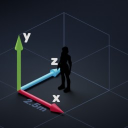 |

## Asset Categorization

| Category | Summary                                                             |                                                   |
|----------|---------------------------------------------------------------------|---------------------------------------------------|
| Floors   | Floor planes usually form the walkable surface                      |     |
| Ceilings | Ceiling meshes are inserted between two vertically stacked floors   | 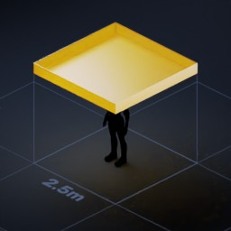 |
| Walls    | Wall meshes fill the sides of cubes                                 |        |
| Trims    | Trim meshes cover corners, intersections and visible cross sections |       |

## Floor Tiles

Floor tiles are simple square meshes that fill the entire bottom side of the cube they occupy. They must only contain
upwards facing parts and must be infinitely tileable.

|                                                                                |                                                               |
|--------------------------------------------------------------------------------|---------------------------------------------------------------|
| Fill the entire square, so that your mesh is tileable without leaving any gaps |          |
| The origin point is at the minimum point of the cube                           |               |
| Do not add any obstructions                                                    |  |

## Ceiling Tiles

Ceiling tiles turn floor tiles into 3d structures where needed by adding sideways and downward facing details.

|                                                                                                                                                                                           |                                                                |
|-------------------------------------------------------------------------------------------------------------------------------------------------------------------------------------------|----------------------------------------------------------------|
| Fill the entire ceiling square, so that your mesh is tileable without leaving any gaps                                                                                                    | 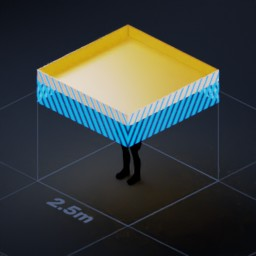 |
| The origin point is at the minimum point of the cube                                                                                                                                      | 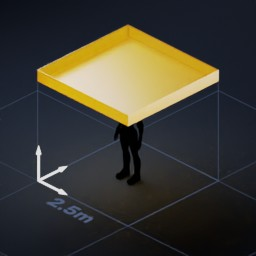            |
| Do not fill the upwards facing cavity. This is where the floor plane of the cube above will be placed, which would create an intersection artifact during rendering.                      |         |
| Do not add any support pillars or other obstructing details. Support pillars can be inserted through separate, rule-based automations that take obstructions like furniture into account. | 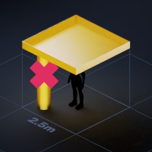 |

## Wall Tiles

Wall tiles can be any shape, but they have to fill one entire side of the cube they occupy. They must be horizontally
and vertically tileable.

### Wall Origin Point

|                                                                                                                              |                                                                       |
|------------------------------------------------------------------------------------------------------------------------------|-----------------------------------------------------------------------|
| The origin point is at the lower left point when facing the wall. Only provide walls in their default (0, 0, 0) orientation. | 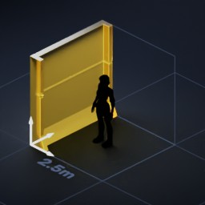                         |
| Example 90 degrees rotated                                                                                                   |    |
| Example 180 degrees rotated                                                                                                  | 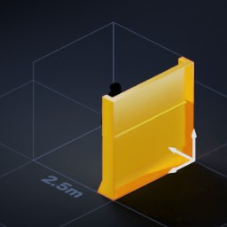 |
| Example 270 degrees rotated                                                                                                  |  |
| The origin point stays in place regardless of which part of the wall it is                                                   | 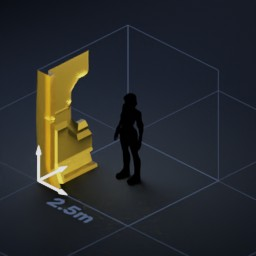                      |
| Example window half right                                                                                                    |                     |

### Solid Wall Tiles

|                                                                              |                                                              |
|------------------------------------------------------------------------------|--------------------------------------------------------------|
| Example                                                                      | 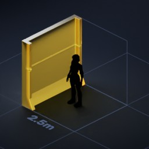        |
| Fill the entire square                                                       | 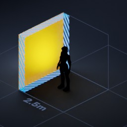          |
| Do not add any cutouts at intersection points where other walls will connect | 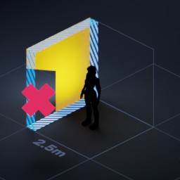 |

### Connected Wall Tiles

Some details like windows or wide door frames can span multiple tiles. These connected structures are split into four
parts:

- Left and right caps limit the structure on both ends
- Left and right connectors are repeated to fill the span between the caps

For the purposes of this segmentation, connected wall tiles are split in half so that each half can be swapped out
depending on its position within the structure.

#### Connected Window Example

|                         |                                                                    |
|-------------------------|--------------------------------------------------------------------|
| Example Window          | 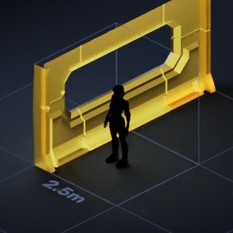                |
| Example Left Cap        |      |
| Example Right Connector |  |
| Example Left Connector  |    |
| Example Right Cap       |    |

#### Connected Door Frame Example

|                         |                                                                  |
|-------------------------|------------------------------------------------------------------|
| Example Door Frame      |             |
| Example Left Cap        |      |
| Example Right Connector |  |
| Example Left Connector  |    |
| Example Right Cap       |    |

## Trim Tiles

Trim meshes cover up visible cross-sections and mesh intersections, and can be added as artistic detail to enhance the
look of your designs. When designing these meshes, take these properties into consideration:

- Corners and trim meshes are always split in half so that they can adapt their shape depending on the left and right
  neighbours of the wall they're attached to
- Corner and trim meshes must support the three possible connection cases for each side of the wall:
    - Straight wall
    - Inner corner
    - Outer corner

|                  |                                                             |
|------------------|-------------------------------------------------------------|
| Example Inner    |        |
| Example Straight | 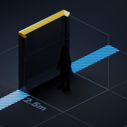 |
| Example Outer    |        |

### Trim Origin Point

|                                                                 |                                                       |
|-----------------------------------------------------------------|-------------------------------------------------------|
| The trim origin follows the wall origin the trim is attached to | 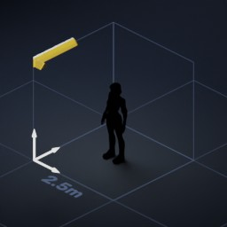         |
| This also applies to right halves                               | 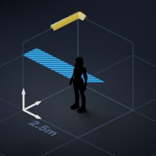   |
| Outer corners belong to the wall that specifies the corner type |  |

### Corners

Corner meshes are placed at inner and outer corners, and wherever two walls with incompatible geometries meet.

|                                                                                                                                                                                                                                                                                       |                                                              |
|---------------------------------------------------------------------------------------------------------------------------------------------------------------------------------------------------------------------------------------------------------------------------------------|--------------------------------------------------------------|
| Inner corners provide a cover for the area where the two facing walls intersect. Since the left and right wall in a corner may have different types, corners are split in two along the diagonal.                                                                                     | 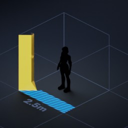 |
| Straight corners provide a clean transition for two adjacent walls that do not have matching types. They are only required for walls which are thin or have special shapes, where the absence of a transition mesh would leave visible gaps between the two neighbouring wall meshes. |                                                              |
| Outer corners provide a clean transition for two walls that only touch along their back side. These corner meshes may reach into the square which lies between the two walls. Like inner corners, outer corners are split in two along the diagonal.                                  | 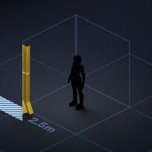 |

### Vertical Caps

Vertical caps are placed on top of all walls which have no other walls stacked on top of them. They seal off the wall
mesh and provide it a clean finish.
Like corner meshes, vertical caps are split diagonally for inner and outer corners.

|                  |                                                                 |
|------------------|-----------------------------------------------------------------|
| Example Inner    | 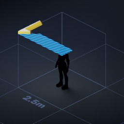       |
| Example Straight |  |
| Example Outer    | 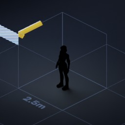       |

## Specializations

### Windows

> In the following section, any transparent or semi-transparent surface which is not self-contained is considered a
> window.

Window meshes should be part of the surrounding mesh, but use a separate material.  
Window designs need to take two scenarios into consideration:

1. A window may be placed as part of an outside wall, separating the indoor space from the city
2. A window may be placed within a space, separating two indoor spaces

Due to this, window meshes need to provide two separate emission textures, one for each mode:

| Mode    | Properties                                                        |                                                          |
|---------|-------------------------------------------------------------------|----------------------------------------------------------|
| Indoor  | Uses alpha transparency from the albedo texture + indoor emission |     |
| Outdoor | Fully opaque + emission faking outdoor light shining in           | 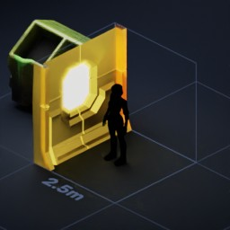 |

### Doors

Structural elements like floors, walls and ceilings should only contain static parts. Interactive elements like doors,
hatches and other kinds of interactive mechanisms to control passages are placed separately like furniture, with some
restrictions to only allow placing them inside door frames, for example.

|                                     |                                                 |
|-------------------------------------|-------------------------------------------------|
| Door placed in a fitting door frame | 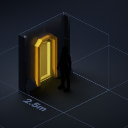 |

## Considerations

### Mixed Walls

Users can apply different designs on each side of a wall.

|                                                                                                                  |                                                     |
|------------------------------------------------------------------------------------------------------------------|-----------------------------------------------------|
| Every color change in the picture represents a different, unique wall design plus corresponding trims & corners. | 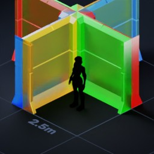 |

### Decorations

Wall mounted decorations like posters, picture frames, monitors & shelfs each specify attachment points where they are
mounted to a wall. They can only be placed if their placement volume starting at the attachment point is unobstructed.

When designing walls, take the placement of decorations into consideration by incorporating surfaces that offer
unobstructed space for wall mounted features.

|                                               |                                                        |  
|-----------------------------------------------|--------------------------------------------------------|
| Poster is on a solid surface                  | 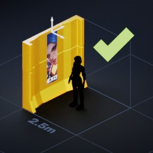   | 
| Attachment point is on a solid surface        | 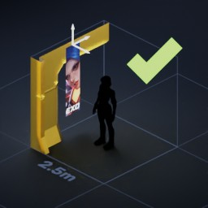 | 
| Poster clips into the wall                    |      |                                                     
| Poster intersects with a dedicated door space | 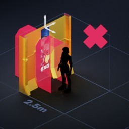   |                                                     